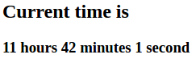

# Localization with webpack and c-3po

This short tutorial will demonstrate how c-3po can be used with webpack.
Both development and production setups will be described.

1. Initial setup
    1. Why should I care about dev and prod setup?
    2. Application overview
    3. Installation
    4. Basic app setup (date time view).
    5. Wrapping strings with c-3po functions and tags.
    6. Server setup.
2. Translations extraction.
3. Dev setup.
    1. Loading translations with loader
4. Prod setup.
    1. Loading translations with c-3po loader.
    2. Reducing result bundle size with c-3po mock.
 

## 1. Initial setup

### 1.1 Why should I care about dev and prod setup?
There are different requirements to development and production setup.

Requirements for the dev setup:

1. Faster builds.
2. Simple setup.
3. Fast feedback.

Prod. setup:
1. Smaller assets.
2. Less work to load locale (faster locale load).

According to this requirements c-3po provides you options for making
efficient production and development setups.

### 1.2 Application overview
For demonstration purposes we will implement simple clock applicaiton.
Something like implemented [here](https://jsfiddle.net/AlexMost/9wuafbL5/7/) but with the ability
to dynamically switch the language.


Sources - [here](https://github.com/c-3po-org/c-3po/tree/master/examples/webpack-setup)

### 1.3 Installation

1. Firstly we need to create separate folder run **npm init **and  execute [installation](/chapter1.md) instructions.
```bash
npm install --save c-3po && npm install --save-dev babel-plugin-c-3po
```
2. Also we need to install webpack and babel loader for the webpack.
> just following install instructions from [here](https://github.com/babel/babel-loader)
```bash
npm install babel-loader babel-core babel-preset-env webpack --save-dev
```

### 1.4 Basic app setup
Now we are ready to make some basic setup for our application. It will consist of index.html 
file and app.js. Let's add **./dist** directory and add **index.html** there:
```html
<!DOCTYPE html>
<html lang="en">
<head>
    <meta charset="UTF-8">
    <title>Webpack with c-3po demo</title>
</head>
<body>
<div id="content"></div>
<script src="./app.js"></script>
</body>
</html>
```
Nothing special, just some html boilerplate.

Let's add **app.js** file also, that will contain our simple business logic:
```js
import { ngettext, msgid, t } from 'c-3po';
const content = document.getElementById('content');

const view = (hours, minutes, seconds) => {
    const hoursTxt = `${hours} hours`;
    const minutesTxt = `${minutes} minutes`;
    const secondsTxt = `${seconds} seconds`;

    return `
    <h1>${ t`webpack with c-3po localization demo` }</h1>
    <h2>${ t`Current time is` }</h2>
    <h3>${hoursTxt} ${minutesTxt} ${secondsTxt}</h3>
    `
};


setInterval(() => {
    const date = new Date();
    content.innerHTML = view(date.getHours(), date.getMinutes(), date.getSeconds());
}, 1000);

```
This is simple program that will display current time:

> 

Let's make setup for webpack. Here is our **webpack.config.js**:

```js
module.exports = {
    entry: './app.js',
    output: { filename: './dist/app.js' },
    module: {
        rules: [
            {
              test: /\.js$/,
              exclude: /(node_modules|bower_components)/,
              use: { loader: 'babel-loader' }
           }
        ]
    }
}
```

And now we can execute **webpack** to build our **app.js** file and open index.html in browser.

### 1.5 Wrapping strings with c-3po functions and tags

Let's wrap our literals in **ngettext** and **t**:


```js
import { ngettext, msgid, t } from 'c-3po';

const view = (hours, minutes, seconds) => {
    const hoursTxt = ngettext(msgid`${hours} hour`, `${hours} hours`, hours);
    const minutesTxt = ngettext(msgid`${minutes} minute`, `${minutes} minutes`, minutes);
    const secondsTxt = ngettext(msgid`${seconds} second`, `${seconds} seconds`, seconds);

    return `
    <h1>${ t`webpack with c-3po localization demo` }</h1>
    <h2>${ t`Current time is` }</h2>
    <h3>${hoursTxt} ${minutesTxt} ${secondsTxt}</h3>
    `
};
```

> more about ngettext - [here](ngettext.md) and about t - [here](tag-gettext--t-.md)

We specified all plural forms for en locale, and everything is ready to build webpack and see
how they are working in the browser:

> 

You can notice that plural forms are working without any extra configuration.
This behaves so, because c-3po works with english locale out of the box.

### 1.6 Server setup
...

### ---------------------------------------
### Step 3. Extracting translations
To be able to execute all commands from this step you need to install GNU **gettext** utility.
(msginit, msgmerge commands should be available). The very generic description of h gettext translation phases are:
1. You wrap all your literals with special functions (gettext, ngettext e.t.c).
2. Extracting translations to .pot files (template files).
3. Updating existing .po files with newly extracted translations from .pot.
4. Translator adds translations to appropriate locales inside .po files.
5. Resolving translations from .po files.

Let's start with extraction step. c-3po will extract translations that it will find only if it has
**[extract.output](configuration.md#configextractoutput-string)** setting, 
let's modify our webpack.config.js to be able to work in the extract mode.

```js
module.exports = ({ extract } = {}) => { // webpack 2 can accept env object
    const c3po = {};

    if (extract) {
        c3po.extract = { output: 'template.pot'} // translations will be extracted to template.pot
    }
    
    return {
        entry: './app.js',
        output: {
            filename: './dist/app.js'
        },
        module: {
            rules: [
                {
                    test: /\.(js|jsx)$/,
                    use: {
                        loader: 'babel-loader',
                        options: {plugins: [['c-3po', c3po]]}
                    }
                }
            ]
        }
    }
};
```
Let's extract translated strings by executing `webpack --env.extract`.

The resulting extracted .pot file:
```
msgid ""
msgstr ""
"Content-Type: text/plain; charset=utf-8\n"
"Plural-Forms: nplurals=2; plural=(n!=1);\n"

#: app.js:5
msgid "${ hours } hour"
msgid_plural "${ hours } hours"
msgstr[0] ""
msgstr[1] ""

#: app.js:6
msgid "${ minutes } minute"
msgid_plural "${ minutes } minutes"
msgstr[0] ""
msgstr[1] ""

#: app.js:7
msgid "${ seconds } second"
msgid_plural "${ seconds } seconds"
msgstr[0] ""
msgstr[1] ""

#: app.js:10
msgid "webpack with c-3po localization demo"
msgstr ""

#: app.js:11
msgid "Current time is"
msgstr ""
```

### Step 4. Localization
For example, let's add some locale. For this tutorial, I have chosen my native locale - uk,
because I am from the Ukraine. Let's use `msginit` tool for creation of .po file with all
appropriate to uk locale headers:

```bash
msginit -i template.pot -o uk.po -l uk
```

The next step is to add translations to uk.po. You can check this file [here](https://github.com/c-3po-org/c-3po/blob/master/examples/webpack-setup/uk.po).

Here are the translations:

```
#: app.js:5
msgid "${ hours } hour"
msgid_plural "${ hours } hours"
msgstr[0] "${ hours } година"
msgstr[1] "${ hours } години"
msgstr[2] "${ hours } годин"

#: app.js:6
msgid "${ minutes } minute"
msgid_plural "${ minutes } minutes"
msgstr[0] "${ minutes } хвилина"
msgstr[1] "${ minutes } хвилини"
msgstr[2] "${ minutes } хвилин"

#: app.js:7
msgid "${ seconds } second"
msgid_plural "${ seconds } seconds"
msgstr[0] "${ seconds } секунда"
msgstr[1] "${ seconds } секунди"
msgstr[2] "${ seconds } секунд"

#: app.js:10
msgid "webpack with c-3po localization demo"
msgstr "Демо локалізації з c-3po та webpack"

#: app.js:11
msgid "Current time is"
msgstr "Поточний час"
```

After all, translations are added, we should modify our webpack config to be able to produce
localized assets.

```js
module.exports = ({ extract, locale } = {}) => {
    const c3po = {};

    if (extract) {
        c3po.extract = { output: 'template.pot'}
    }

    if (locale) { // add locale setting for c-3po babel plugin
        c3po.resolve = { translations: `${locale}.po` };
    }

    return {
        entry: './app.js',
        output: {
            // change build path (depends on locale).
            filename: locale ? `./dist/${locale}/app.js` : './dist/app.js'
        },
        module: {
            rules: [
                {
                    test: /\.(js|jsx)$/,
                    use: {
                        loader: 'babel-loader',
                        options: {plugins: [['c-3po', c3po]], cacheDirectory: !(c3po.extract || c3po.resolve) }
                    }
                }
            ]
        }
    }
};
```
> it's better to disable cacheDirectory for extract and resolve phase.
> Check this [link](why-po-is-not-updated.md) for the details.

Let's build localized assets with command `webpack --env.locale=uk`.
> If you are still using webpack 1, you can use simple env vars instead of
webpack env. For example: `LOCALE=uk webpack`.

To see that it works le'ts modify scr attribute in *index.html*:
```html
<script src="./uk/app.js"></script>
```

> This step is done manually just for demo purpose, in the real world url will be modified
somewhere on a backend that renders html output.

Let's check what we see in browser:

> 

Note that Ukrainian locale has 3 plural forms, this information is fetched from the **uk.po** file
headers.

### Setp 5. Updating .po files with new translations
In future you will add more string literals to your app, and you will need to update .po files.
I suggest to use `msgmerge` for that. Here is an example:
````bash
msgmerge uk.po template.pot -U
````

### More realistic case
Here is the separate repository where I used the code from this tutorial 
to publish on gh-pages - [https://github.com/c-3po-org/webpack-demo](https://github.com/c-3po-org/webpack-demo).
I have added StaticSiteGeneratorPlugin to generate html output for each locale.
